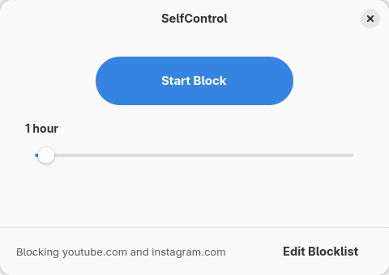
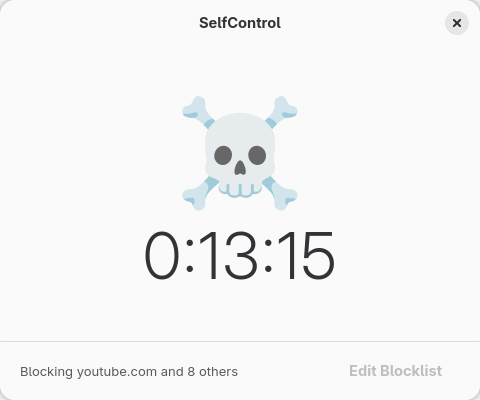

# SelfControl for Linux

A Linux port of the macOS [SelfControl](https://github.com/SelfControlApp/selfcontrol) app. Block distracting websites for a set duration. Once a block is started, it cannot be undone — even if you restart your computer.




## How It Works

- Blocks websites via `/etc/hosts` (DNS-level) **and** nftables firewall rules (IP-level)
- A root daemon enforces blocks — you can't bypass them by editing `/etc/hosts` (an inotify watcher restores entries within seconds)
- Block duration is stored as an absolute timestamp, so blocks survive reboots
- Rules are re-enforced every 5 seconds in case of firewall reloads or manual deletion

## Requirements

- Fedora Linux (tested on Fedora 43, should work on 38+)
- GNOME desktop (GTK4 / libadwaita)

## Installation

```bash
git clone https://github.com/rhlc/selfcontrol-linux.git
cd selfcontrol-linux
sudo bash setup.sh
```

This installs all dependencies, copies files to system directories, and enables the daemon service.

## Usage

Launch **SelfControl** from your application menu, or run:

```bash
selfcontrol
```

1. **Edit Blocklist** — add or remove websites to block (default: facebook, twitter, instagram, reddit, youtube)
2. **Adjust duration** — drag the slider from 15 minutes to 24 hours
3. **Start Block** — click to begin. The button turns red and shows a countdown. The slider and blocklist editor are locked until the block expires.

That's it. Wait it out.

## Uninstalling

```bash
# Remove installed files
sudo rm -rf /usr/lib/selfcontrol-linux
sudo rm /usr/bin/selfcontrol /usr/libexec/selfcontrol-daemon
sudo rm /usr/share/dbus-1/system.d/com.github.selfcontrol.conf
sudo rm /usr/share/dbus-1/system-services/com.github.selfcontrol.service
sudo rm /usr/share/polkit-1/actions/com.github.selfcontrol.policy
sudo rm /usr/lib/systemd/system/selfcontrol-daemon.service
sudo rm /usr/share/applications/com.github.selfcontrol.desktop
sudo rm -rf /var/lib/selfcontrol-linux
sudo systemctl daemon-reload
```

## Architecture

```
GUI (Python + GTK4/libadwaita, runs as user)
  │
  │ D-Bus (system bus)
  ▼
Daemon (Python, runs as root via systemd)
  ├── /etc/hosts modification (with BEGIN/END markers)
  ├── nftables firewall rules (separate inet selfcontrol table)
  ├── inotify watcher (detects /etc/hosts tampering, re-applies)
  └── state persisted to /var/lib/selfcontrol-linux/state.json
```

## License

MIT
